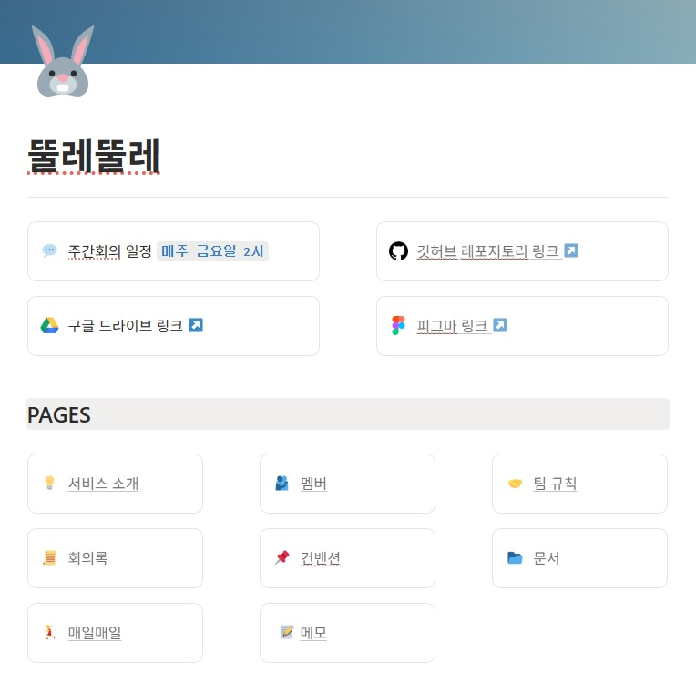

 

## 프로젝트 소개

뚤레뚤레는 **장소 저장부터 여행 계획 작성까지 한곳에서 관리할 수 있는 여행 계획 협업 웹 서비스**입니다.

실제 여행을 준비하면서 장소는 지도 서비스에, 일정은 일정 관리 서비스에, 여행용 핸드북은 디자인 툴에 각각 따로 관리해야 하는 불편함을 자주 겪었습니다. 이러한 문제를 해결하기 위해 장소 저장부터 일정 작성, 협업까지 하나의 서비스에서 해결하여 **여행 준비 과정을 더욱 단순하고 효율적으로 만드는 것**을 목표로 기획했습니다.

현재 PC 환경을 기준으로 1차 MVP를 개발 중이며, 이후 모바일 대응, 여행 핸드북 이미지 출력, 오프라인 모드, 체크리스트 기능 등을 순차적으로 지원할 예정입니다.

### 작업기간

2026/3/14 ~ 작업중

 

## 주요 기술 요약

<strong>렌더링 & 데이터 페칭</strong>

- TanStack Query의 prefetchInfiniteQuery와 HydrationBoundary를 활용하여 SSR 단계에서 초기 데이터를 프리패치함으로써, 클라이언트 사이드 데이터 호출 대기 시간을 제거하고 사용자가 화면 로드 시점부터 인터랙션할 수 있도록 구조화
- Next.js App Router의 서버·클라이언트 실행 경계를 고려하여 Route Handler 기반 데이터 요청 구조를 설계하고, SSR과 CSR이 동일한 인증 흐름을 재사용하도록 Route Handler 기반 데이터 조회 구조를 설계

<strong>인증 및 권한 관리 아키텍처</strong>

- Auth.js v5와 Supabase를 연동한 httpOnly 쿠키 기반 인증 구조를 설계하고, JWT 알고리즘 호환성(ECC/HS256) 문제를 분석·해결하여 안정적인 인증 체계를 구축

<strong>SSR 기반 무한 스크롤 구조</strong>

- 스켈레톤 없이 초기 데이터는 prefetch로 채우고, 이후 더보기 페칭만 useSuspenseInfiniteQuery로 처리하는 구조로 초기 로딩과 추가 로딩의 책임을 분리
- QueryBoundary(Suspense + ErrorBoundary)를 적용해 추가 데이터 조회 중 발생하는 에러를 별도로 캐치하고 사용자에게 노출
- 초기 로딩은 서버에서, 추가 조회는 클라이언트 상태로 나눔으로써 불필요한 재조회 없이 자연스러운 스크롤 경험 구성

<strong>공유 기능 및 권한 제어</strong>

- 보기용·수정용 권한을 하나의 초대 시스템으로 관리하기 위해 resourceType 기반 공용 공유 구조를 설계

공유 옵션 모달에서 공개/비공개 설정에 따라 분기되는 초대 로직 구현 (resourceType으로 장소 리스트/계획을 구분하여 공용으로 사용 가능하도록 설계)

- 초대 링크 접속 시 토큰 검증 → 참여 등록 → 권한 검증 순서로 처리되도록 서버 컴포넌트 전용 유틸 함수를 설계하여, 수정 가능 유저와 보기용 접근 유저의 일관성 있는 접근 처리 흐름을 구축
- 토큰 검증 로직과 권한 검증 로직을 완전히 분리함으로써, 초대 컴포넌트를 통한 진입과 URL 직접 접근(딥링크) 케이스 모두에서 세션 유무/토큰 유효성에 따른 에러 모달 노출 및 리다이렉트 처리가 일어나도록 구조화

<strong>컴파운드 패턴 기반 공용 UI 컴포넌트</strong>

- Zustand 기반 전역 모달 스토어와 컴파운드 컴포넌트 패턴으로 구현하여 모달 전용 컴포넌트(Modal/ModalBox/ModalContent/ModalTitle 등)를 조합 가능한 구조로 설계
- 드롭다운 메뉴는 별도 DropdownContext로 열림 상태를 관리하고, Floating UI로 화면 경계에 따라 위치가 자동으로 조정되도록 구현
- 로비 화면의 여행 아이템, 사이드바 프로필, 초대 링크 입력 모달 등 공통 컴포넌트로 재사용하여 UI 구현 중복을 줄이고 일관된 사용자 경험을 유지

<strong>검색 UX 및 다국어 검색 최적화</strong>

- 다국어 부분 검색을 지원하기 위해 Generated Column과 pg_trgm GIN Index를 적용하여 검색 성능과 정확도를 개선
- 한국어 IME 조합 입력(isComposing), 키보드 탐색, URL 상태 동기화를 지원하는 AutoComplete 컴포넌트
  를 구현하여 검색 사용성을 개선

<strong>RPC 기반 트랜잭션 설계</strong>

- 장소 생성과 이미지 등록 등 여러 테이블에 걸친 작업을 PostgreSQL RPC 함수로 묶어 트랜잭션을 보장
- 중간 단계 실패 시 데이터 정합성이 깨지는 문제를 방지하고, 클라이언트는 하나의 API 호출만으로 일관된 결과를 보장하도록 설계

 

## Skills

## 팀원 소개

  
|||
|:---:|:---:|
| [최수진](https://github.com/tomatto0) | [조현진](https://github.com/JOEIH) |

 

<!-- ## Flow chart

게시글 작성페이지 유저플로우

사용자 인증 유저 플로우 

 -->

## 📙 기획 문서

프로젝트 노션

[🔗 Notion 바로가기](https://app.notion.com/p/291726cada088276a06481fe27ec1a43?source=copy_link)

FIGMA

[🔗 FIGMA 바로가기](https://www.figma.com/design/nya2tGKklbyEdpl0GYHM46/ttulettule-%ED%99%94%EB%A9%B4%EA%B8%B0%ED%9A%8D%EC%84%9C-%EC%99%B8%EB%B6%80%EA%B3%B5%EA%B0%9C%EC%9A%A9?node-id=0-1&t=kL2pYKHbW4WKgUYu-1)

 

## 페이지 주요 기능

### 첫 화면

- 로그인 및 여행 초대 링크를 통한 서비스 진입
- 초대 링크 접속 시 로그인 후 해당 여행 계획으로 바로 이동
- 서비스 공지 및 업데이트 안내 모달 제공 (예정)

 

### 로비

- 참여 중인 여행을 예정/지난 여행으로 구분하여 관리
- 초대 링크를 입력해 새로운 여행 계획 참여
- 계획 진입 없이 복제, 삭제, 속성 변경 등 빠른 관리 지원
- 서비스 업데이트 및 공지사항 확인(예정)

 

### 장소 리스트 페이지

- 장소를 검색하여 리스트 또는 여행 계획에 추가
- 여행 계획과 별도로 장소 리스트를 생성·관리
- 태그 기반 필터링으로 원하는 장소만 빠르게 탐색
- 장소 상세 정보와 Google 지도를 동시에 확인

 

### 장소 리스트 관리

- 장소 리스트 이름, 아이콘, 공개 여부 수정
- 태그 및 공동 관리 권한 설정
- 리스트에 포함된 장소를 일괄 추가·삭제

 

### 계획 편집 페이지 - 단일 뷰

- 날짜별 여행 일정을 편집하고 이동 동선을 지도에서 확인
- 단일 뷰와 전체 뷰를 전환하며 일정 관리
- 장소 리스트에서 원하는 날짜로 드래그하여 일정 추가
- 장소 일정과 메모 일정을 함께 작성하여 자유로운 계획 구성
- 계획 정보와 공유 설정 관리

 

### 계획 편집 페이지 - 전체 뷰

- 여행 일정을 날짜별로 한눈에 확인
- 일정 순서 변경 및 날짜 간 이동 지원
- 여러 날짜의 일정을 비교하며 계획 수정
- 단일 뷰와 자유롭게 전환

 

### 장소 검색 - DB

자동완성 검색 및 다국어 검색 지원
검색 결과를 장소 리스트 또는 여행 계획에 즉시 추가

 

### 새로운 장소 추가

- Google Places API를 이용한 장소 검색
- 최초 검색한 장소는 자체 DB에 저장하여 재사용
- 신규 장소 추가 후 바로 검색 결과 페이지에서 장소 리스트 또는 여행 계획에 즉시 추가

 

### 여행 계획 생성

- Chat-style 입력 UI를 통한 여행 계획 생성
- 여행 정보, 기간, 참여자 등을 단계별 입력
- 생성 즉시 일정 편집 화면으로 연결
